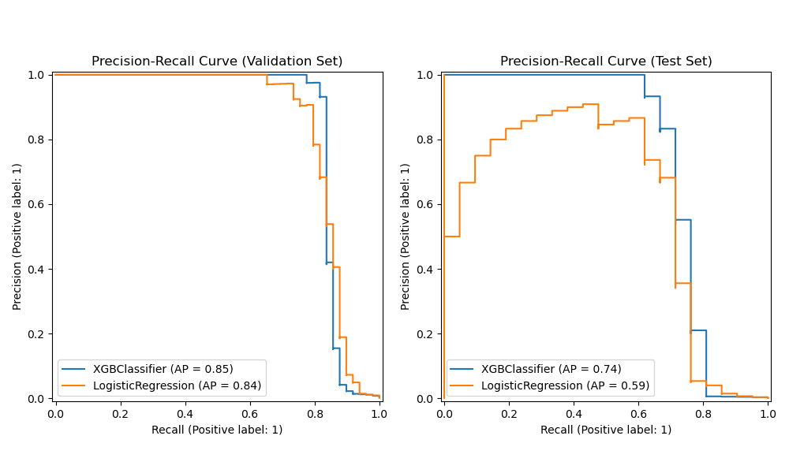
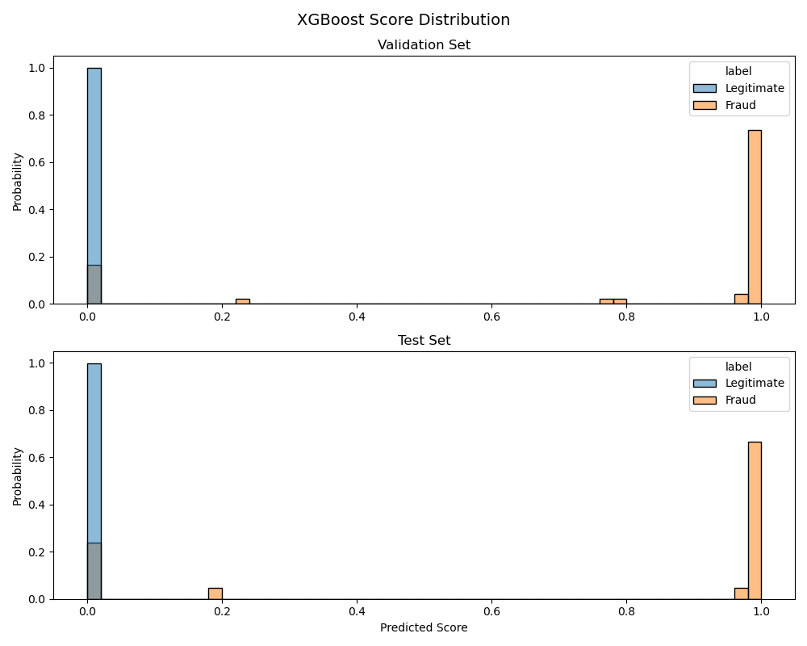

# Fraud Detection AI Agent

A fraud detection AI agent, which calls a custom XGBoost model deployed on Google Cloud to score transactions for fraud. The AI agent subsequently provides explanations on the influential input features, as well as the recommended next steps. Note that the XGBoost model which does the fraud scoring was trained by myself -- building a fraud detection ML model is not a trivial task, requiring intense attention to detail and deep domain-specific knowledge (e.g. whether it be payment fraud, return fraud, etc.), and fraudsters continuously adapt their patterns in a never ending tit-for-tat (which is precisely why you need to hire ML engineers like myself 😎). 

## 🎙️ Prompt
```
Check this transaction for fraud: 
        V1=-0.49, V2=-0.56, V3=0.59, V4=-1.66, V5=-0.26, 
        V6=0.63, V7=0.27, V8=0.06, V9=-0.95, V10=0.22, 
        V11=0.35, V12=0.02, V13=0.42, V14=-0.51, V15=-1.22, 
        V16=1.03, V17=0.03, V18=-1.08, V19=1.69, V20=0.10, 
        V21=-0.08, V22=-0.21, V23=0.19, V24=0.21, V25=-0.97, 
        V26=-0.62, V27=0.20, V28=0.15, 
        Amount=175.66
```


## 🪬 Agent Output
The LLM being used here is Anthropic's Claude Sonnet 4.6, with some custom prompt-engineering. What makes this an AI Agent, rather than a simple LLM call, is the implementation of the **agentic loop**; the LLM is deciding on it's own how many times to call the fraud detection machine learning model. While this may sound like a technical detail for now, an AI agent becomes capable of executing much more complex workflows as we continue to build on the loop (e.g. giving it more models and data streams to cross-reference against, instructions on how and when to escalate for specific situations, or giving it document-creation tasks etc.)


Also note that the LLM does not have to be any particular one, and I could also build a custom fine-tuned LLM for your organization (using the open weights from OpenAI, Deepseek, etc.) hosted locally on your company's servers. 

```
Here's a full breakdown of the fraud analysis results:

---

## 🟢 Verdict: Legitimate Transaction

| Detail | Value |
|---|---|
| **Fraud Probability** | ~0.0001% (essentially zero) |
| **Decision Threshold** | 23.6% |
| **Flagged as Fraud?** | ❌ No |

This transaction is **extremely unlikely to be fraudulent**. Its fraud probability of ~0.0001% is far below the 23.6% threshold needed to trigger an alert.

---

## 🔍 Top Contributing Features (SHAP Explanation)

All five top features **pushed the risk down**, reinforcing the legitimate classification:

| Rank | Feature | Value | Impact | What It Suggests |
|---|---|---|---|---|
| 1 | **V4** | -1.66 | ⬇️ Strongly decreases risk | V4 is one of the most powerful fraud indicators — its negative value here is strongly associated with **normal, non-fraudulent behavior** |
| 2 | **V14** | -0.51 | ⬇️ Decreases risk | V14 is another highly predictive feature; this value aligns well with **legitimate transaction patterns** |
| 3 | **V27** | 0.20 | ⬇️ Decreases risk | A mild positive value in V27 is consistent with **genuine cardholder activity** |
| 4 | **V12** | 0.02 | ⬇️ Decreases risk | V12 near zero is a neutral-to-positive signal, typical of **routine transactions** |
| 5 | **V16** | 1.03 | ⬇️ Decreases risk | A moderately elevated V16 contributes to a **lower fraud likelihood** |

---

## 💡 Summary & Recommendation

> ✅ **No action needed.** Every key signal in this transaction points away from fraud. The model's base fraud expectation (before seeing any features) started at ~4.7%, but the transaction's feature profile collectively **drove that probability down to near zero**. The transaction amount of **$175.66** is also unremarkable and does not raise any red flags.

This transaction can be safely **approved and processed**. 🟢
```


# ⚒️ Work In Progress
* At the moment, the agent relies on the outputs of a single XGBoost model for scoring, but I have ambitions to expand the agentic loop to make it multi-stage
    1. XGBoost for individual transaction-level scoring
    2. Graph Neural Network for fraud ring identification
    3. LSTM & Isolation Forest for transaction sequence-level anomaly scoring

* Other things the agent could do, include:
    1. Agentically generating a comprehensive fraud investigation report, including the key transaction attributes which raised suspicion, as well as pulling full transaction history of the account from a SQL database for downstream manual review by analysts
    2. For generating compliance reports, a RAG-type of system would be interesting to build, to reference the relevant regulatory policy documents


# 💡 Additional Context
I decided to work on this project as I am applying to a few fraud detection data science roles, but then I realized it was also a great opportunity to learn how to build AI agents and host custom machine learning models on MCP servers. I also wanted to recap the materials from a course I took two years ago on Graph Neural Networks (XC224: Machine Learning with Graphs by Prof. Jure Leskovec). 

I worked on some fraud detection ML validation projects for Synchrony Bank early in my professional career, and I was aware of the prevalence of XGBoost for transaction-level fraud scoring. XGBoost is popular in finance, and I've also seen it being used for credit scoring (i.e. VantageScore) and for anti-money laundering transaction monitoring applications. Therefore, this project could easily be converted to an AI agent for agentic credit decisioning, or for agentic generation of SARs reports. 

Some of the notable challenges of building a good fraud detection model include the fact that undetected cases of fraud are generally not identifiable in the data, and the sparsity of true-label examples presents a class imabalance problem when training an ML model. For this project, I paid special attention to selecting the right evaluation metrics for hyperparameter tuning, and made sure that crosstemporal contamination did not arise in how the train/eval/test splits were specified. The XGBoost model's 


<br>


<br>

<br>



# 📁 Description of Files

* `fraud_detection.ipynb`
    * **Info**: Demo of an XGBoost classifier method to flag fraudulent transactions. I also built an AI agent which calls the model as a tool, providing explanations for the features which leading to an approve/decline decision. 
    * **Files**: 
* `gnn.ipynb`
    * **Info**: Demo of a Graph Neural Network based fraud detction model, to identify fraud rings 
* `fraud_agent_system.ipynb`
    * **Info**: Demo of an AI agent system that makes tool calls to the productionized XGBoost and GNN model endpoints, to explain whether a transaction is likely to be fraudulent or legitimate. If the transaction is determined to be fraud, the agent automatically populates fields in a investigative report to streamline downstream manual reviews. 